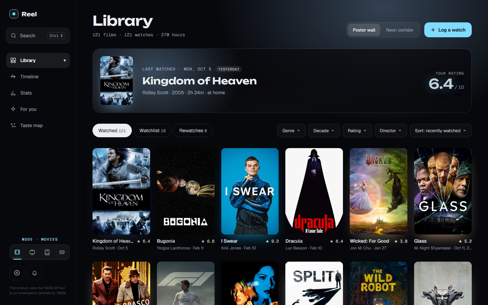
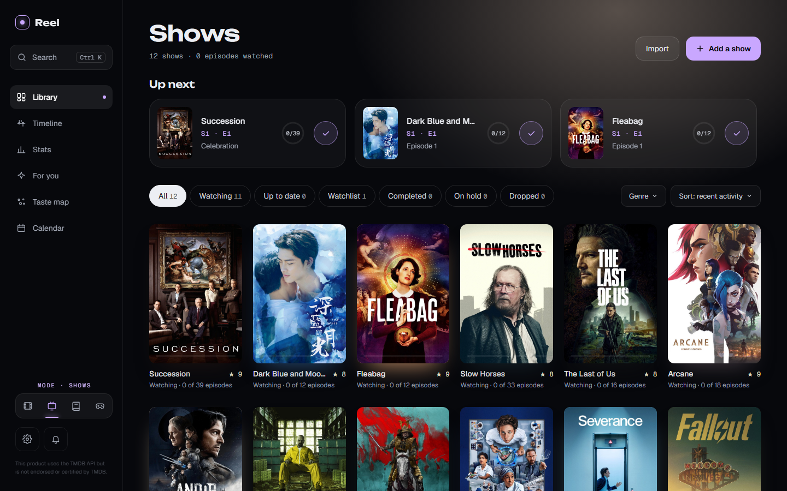
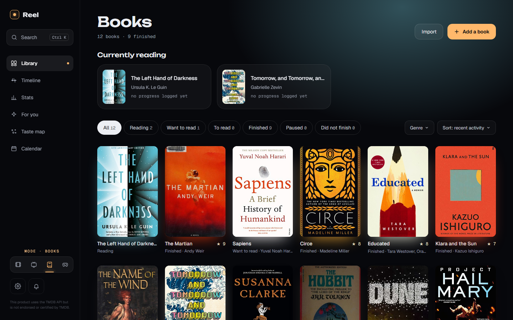
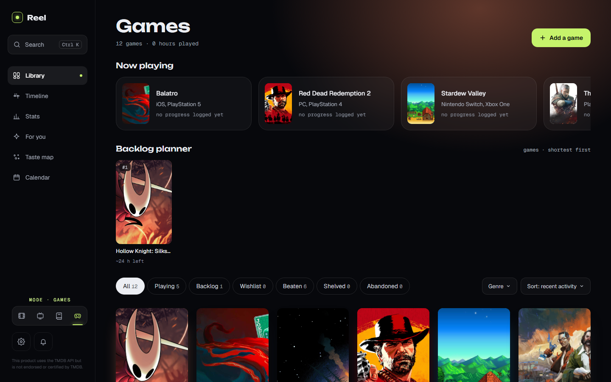
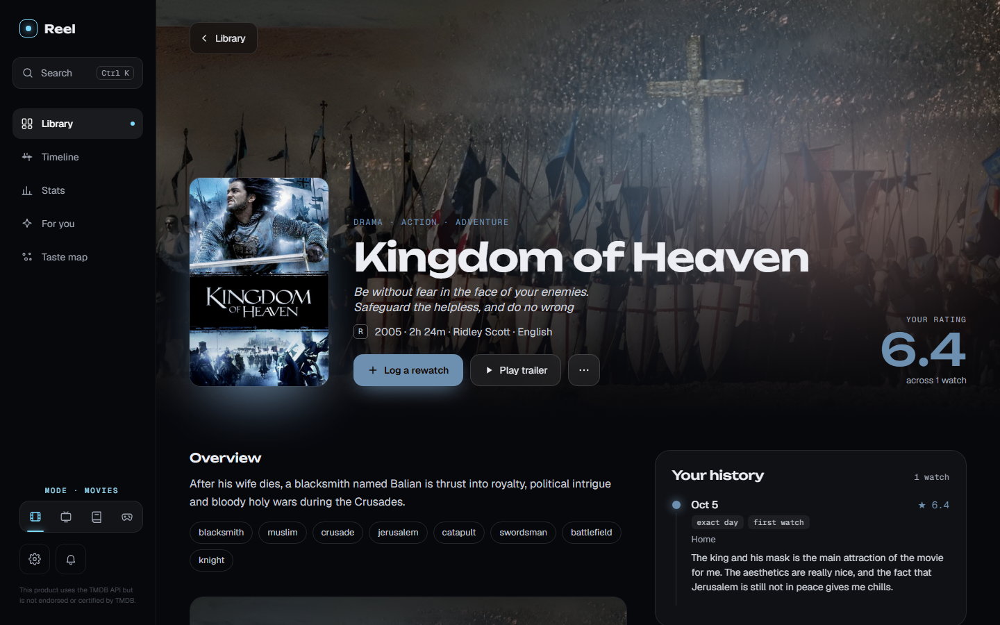
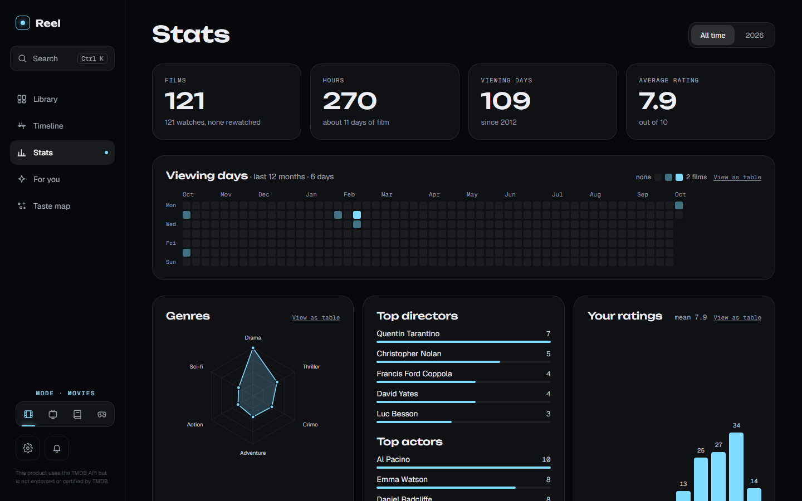
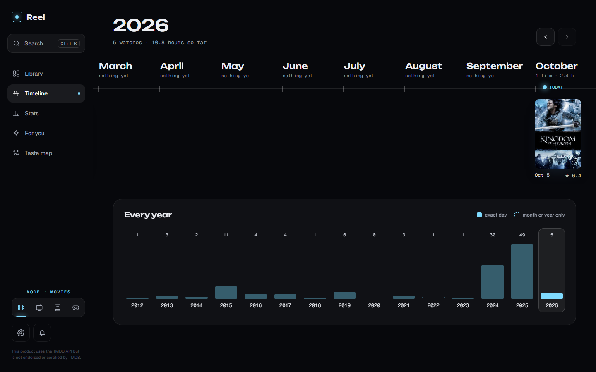
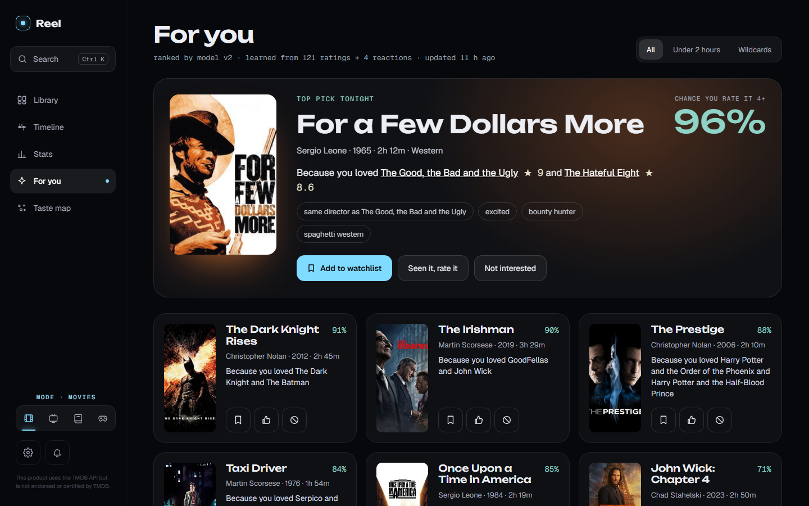
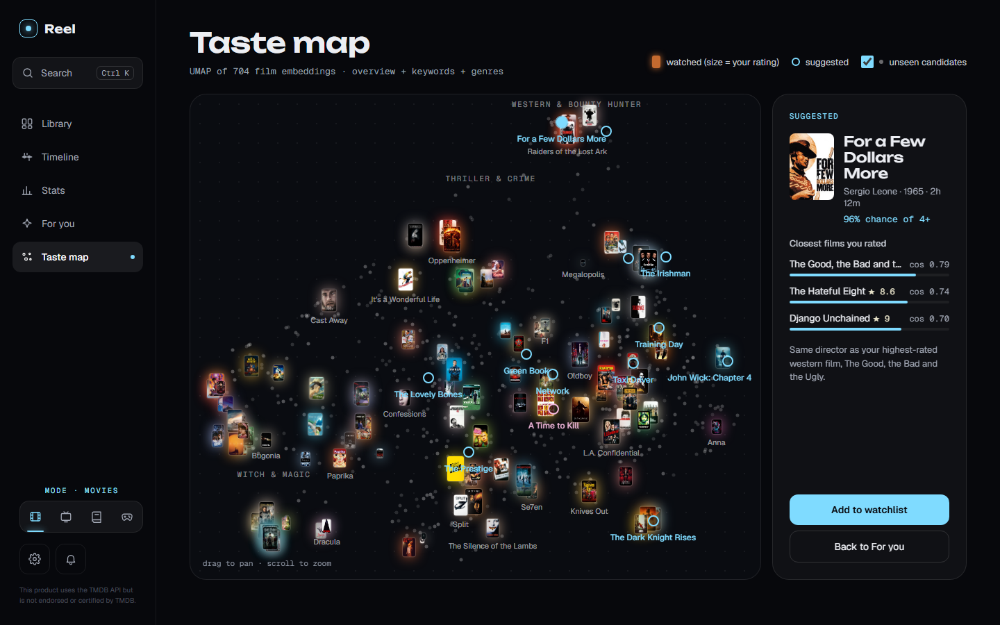
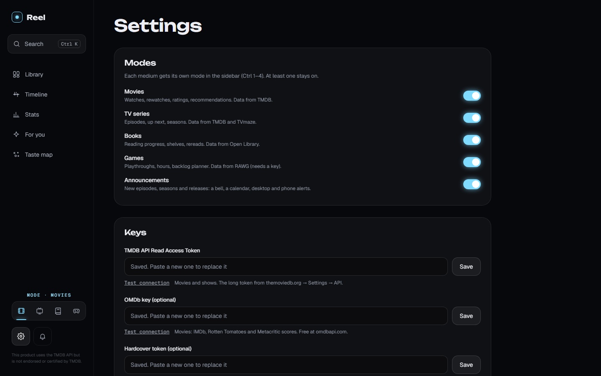

# Reel

A personal diary for films, TV series, books and games, for Windows. Log what you watch, read and play in a couple of keystrokes, see your history as a poster wall, timeline and stats, and get recommendations that learn from your own ratings. Everything runs locally: one SQLite file plus a folder of cached images. No account, no cloud.



| | |
|---|---|
|  |  |
|  |  |
|  |  |
|  |  |
|  | |

## What it does

Reel has four **modes**: Movies, Shows, Books and Games. Switch between them in the sidebar or with `Ctrl 1`–`4`; every page then shows only that medium. Turn each mode on or off in Settings → Modes (at least one stays on), and give each its own accent colour.

- **Log fast.** `Ctrl K` → type → `↵` → press `1`–`5` for stars → `↵`. Or hover any poster and press the check: one tap on a star logs it for today.
- **Library**: poster wall (or a 3D carousel for films) with status, genre, decade and rating filters. Shows track episodes and "up next", books track reading progress and shelves, games track playthroughs and hours.
- **Detail pages** glow in each title's own cover colours: people, trailer, scores and your full history (click an entry to edit it).
- **Timeline** of every month and year, including things you only remember as "sometime in 2019". A watch can also have no date at all ("Date unknown"): it counts in the library and stats but stays off the timeline.
- **Stats**: activity heatmap, genre radar, top people, rating histogram, plus an *All media* view.
- **For you**: recommendations from your ratings with a reason for each ("Because you loved…"), plus wildcards outside your usual taste. "More like this" and "Not interested" teach the model.
- **Taste map**: every title as a point; see why something is recommended.
- **Announcements** (optional): a bell, a calendar, and desktop or phone (ntfy) alerts for new episodes, seasons and releases.
- **Import** Letterboxd, IMDb, Goodreads, StoryGraph and IMDb TV exports, **back up / restore** everything as one zip, and it works **offline** for everything already cached.

## Install (Windows)

You need [uv](https://docs.astral.sh/uv/), [Node.js](https://nodejs.org) 20+ and the free API keys below for the modes you use.

```powershell
git clone https://github.com/Emadab/reel.git
cd reel
cd backend; uv sync; cd ..
cd frontend; npm install; cd ..
pwsh ./install-shortcut.ps1 -StartMenu -Desktop   # builds the UI and adds Reel shortcuts
```

Open **Reel** from the Start menu, go to **Settings**, turn on the modes you want, paste your keys under **Keys** and press **Test connection** next to each one. Keys are written only to `backend/.env` on your machine and are never sent back to the page. You can also fill that file in by hand: copy `backend/.env.example` to `backend/.env`.

After pulling updates, rebuild the UI (`cd frontend; npm run build`) and restart Reel; the shortcut serves the built UI from `frontend/dist`.

The first recommendation pass downloads a small text-embedding model (~130 MB) once.

## API keys

Reel ships with no keys. Every service below is free for personal use, so get your own.

| Key | Used for | Needed? |
|---|---|---|
| TMDB API Read Access Token | Movies and Shows: search, details, images | Yes, for Movies or Shows |
| RAWG key | Games: search, details, covers, playtime | Yes, for Games |
| OMDb key | Movies: IMDb, Rotten Tomatoes and Metacritic scores | Optional |
| Hardcover token | Books: series, release dates, and any descriptions, page counts, genres and covers the other sources miss | Optional |
| Google Books key | Books: missing descriptions and page counts | Optional |
| Contact email | Shows and Books: identifies Reel to TVmaze and Open Library, which raises Open Library's rate limit | Optional |

Open Library (books) and TVmaze (show air times) need no key.

### TMDB (Movies and Shows)

1. Create an account at [themoviedb.org](https://www.themoviedb.org/signup) and confirm your email.
2. Open [Settings → API](https://www.themoviedb.org/settings/api) and request an API key: choose **Developer**, accept the terms and describe the use as a personal, non-commercial app.
3. On the same page copy the **API Read Access Token**: the long one starting with `eyJ`, not the short "API Key".
4. Paste it into Settings → Keys → *TMDB API Read Access Token*.

### RAWG (Games)

1. Sign up at [rawg.io](https://rawg.io/signup).
2. Open [rawg.io/apidocs](https://rawg.io/apidocs), press **Get API Key** and fill in the short form (a personal project is fine).
3. Copy the key from your developer dashboard into Settings → Keys → *RAWG key*.

### OMDb (optional, movie scores)

1. Request a **FREE** key (1,000 requests a day) at [omdbapi.com/apikey.aspx](https://www.omdbapi.com/apikey.aspx).
2. Click the activation link in the email you get; the key is in the same email.
3. Paste it into Settings → Keys → *OMDb key*. Without it Reel still shows IMDb ratings from IMDb's public dataset.

### Hardcover (optional, books)

1. Create an account at [hardcover.app](https://hardcover.app).
2. Open [Account → API](https://hardcover.app/account/api) and copy the token (with or without the `Bearer ` prefix).
3. Paste it into Settings → Keys → *Hardcover token*. Hardcover's API is in beta and tokens can expire; if *Test connection* fails, copy a fresh one.

### Google Books (optional, books)

1. In the [Google Cloud console](https://console.cloud.google.com/) create a project (no billing needed).
2. Open **APIs & Services → Library**, search for **Books API** and press **Enable**.
3. Open **APIs & Services → Credentials → Create credentials → API key**. Optionally restrict the key to the Books API.
4. Paste it into Settings → Keys → *Google Books key*.

## Keyboard

| Keys | Action |
|---|---|
| `Ctrl K` | Search / log from anywhere |
| `Ctrl 1`–`4` | Switch mode: Movies, Shows, Books, Games |
| `↑` `↓` then `↵` | Pick a result and open the log form |
| `Shift ↵` | Add the selected result to the watchlist |
| `1`–`5` | Rate (press again for half a star less), `0` clears |
| `↵` | Save |
| `>` in search | Commands: go to a page, import, back up |

## Develop

```bash
make dev        # API on :8000 + UI on :5173 (hot reload)
make fixtures   # UI on the design's sample data, no backend needed
make test       # backend pytest + frontend unit tests
make visual     # Playwright: compares every screen with design/screenshots
make app        # build the UI and open the desktop window
```

The project brief, architecture and design system are in `CLAUDE.md`, `docs/` and `design/`; the shows, books and games plan and per-phase reports are in `docs/expansion/`.

## Data and privacy

Your library lives in `backend/data/` (database, covers, models) and never leaves your machine. Only title lookups go out, from the backend, to the services above (TMDB, OMDb, TVmaze, Open Library, Hardcover, Google Books, RAWG), plus ntfy.sh if you turn on phone alerts. `backend/.env`, `backend/data/` and any CSV exports in the repo root are git-ignored.

### Backups

```bash
uv run --project backend python scripts/backup.py            # snapshot → backend/data/backups/<timestamp>-manual/
uv run --project backend python scripts/restore.py [<dir>]   # close Reel first; default is the newest snapshot
```

Reel also snapshots the database and images automatically (`<timestamp>-pre-migration`) whenever a new version is about to change the database schema.

## Credits

This product uses the TMDB API but is not endorsed or certified by TMDB. Show air times from [TVmaze](https://www.tvmaze.com) (CC BY-SA). Book data from [Open Library](https://openlibrary.org), [Hardcover](https://hardcover.app) and Google Books. Game data from [RAWG](https://rawg.io). Scores from [OMDb](https://www.omdbapi.com).

## License

[MIT](LICENSE). The API keys and the data they return are covered by each service's own terms.
