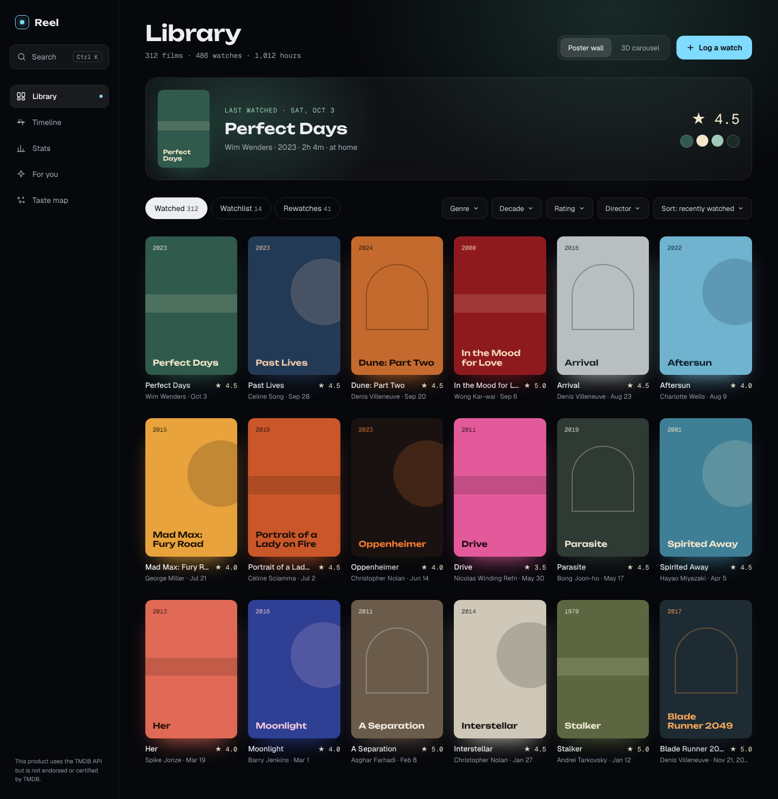

# Reel

A personal film diary for Windows. Log what you watch in a couple of keystrokes, see your history as a poster wall, timeline and stats, and get recommendations that learn from your own ratings. Everything runs locally: one SQLite file plus a folder of cached images.



## What it does

- **Log a film fast.** `Ctrl K` → type → `↵` → press `1`–`5` for stars → `↵`. Or hover any poster and press the check: one tap on a star logs it for today.
- **Library**: poster wall (or a 3D carousel), watched / watchlist / rewatches, filters by genre, decade, rating and director.
- **Film pages** glow in each film's own poster colours: cast, trailer, scores, your full watch history (click a watch to edit it).
- **Timeline** of every month and year, including films you only remember as "sometime in 2019".
- **Stats**: viewing-day heatmap, genre radar, top directors and actors, rating histogram.
- **For you**: recommendations from your ratings with a reason for each ("Because you loved…"), plus wildcards outside your usual taste. "More like this" and "Not interested" teach the model.
- **Taste map**: every film as a point; see why something is recommended.
- **Import** a Letterboxd or IMDb export, **back up / restore** everything as one zip, and it works **offline** for everything already cached.

## Install (Windows)

You need [uv](https://docs.astral.sh/uv/), [Node.js](https://nodejs.org) 20+ and a free TMDB account.

```powershell
git clone https://github.com/Emadab/reel.git
cd reel
cd backend; uv sync; cd ..
cd frontend; npm install; cd ..
pwsh ./install-shortcut.ps1 -StartMenu -Desktop   # builds the UI and adds Reel shortcuts
```

Open **Reel** from the Start menu. On first run it asks for your **TMDB API Read Access Token** (themoviedb.org → Settings → API → "API Read Access Token"). The token is stored only in `backend/.env`. An OMDb key is optional and adds IMDb / Rotten Tomatoes / Metacritic scores.

The first recommendation pass downloads a small text-embedding model (~130 MB) once.

## Keyboard

| Keys | Action |
|---|---|
| `Ctrl K` | Search / log a film from anywhere |
| `↑` `↓` then `↵` | Pick a result and open the log form |
| `Shift ↵` | Add the selected result to the watchlist |
| `1`–`5` | Rate (press again for half a star less), `0` clears |
| `↵` | Save the watch |
| `>` in search | Commands: go to a page, import, back up |

## Develop

```bash
make dev        # API on :8000 + UI on :5173 (hot reload)
make fixtures   # UI on the design's sample data, no backend needed
make test       # backend pytest + frontend unit tests
make visual     # Playwright: compares every screen with design/screenshots
make app        # build the UI and open the desktop window
```

The project brief, architecture and design system are in `CLAUDE.md`, `docs/` and `design/`.

## Data and privacy

Your library lives in `backend/data/` (database, posters, models) and never leaves your machine; only film lookups go to TMDB. `backend/.env`, `backend/data/` and any CSV exports in the repo root are git-ignored.

### Backups

```bash
uv run --project backend python scripts/backup.py            # snapshot → backend/data/backups/<timestamp>-manual/
uv run --project backend python scripts/restore.py [<dir>]   # close Reel first; default is the newest snapshot
```

Reel also snapshots the database and images automatically (`<timestamp>-pre-migration`) whenever a new version is about to change the database schema.

This product uses the TMDB API but is not endorsed or certified by TMDB.
